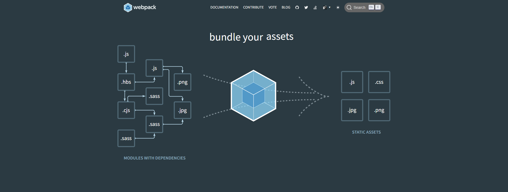

# Tạo dự án ReactJS với Webpack và Babel
Mục đích của project này để hiểu được webpack và có thể hình dung ra dự án được tạo bởi “create-react-app” được xây dựng như thế nào 🤗

## Webpack

### 1. Webpack là gì ?

**Webpack** được biết đến là một công cụ được sử dụng để quản lý các module JavaScript. 

**Webpack** sẽ đóng gói tất cả các mã nguồn của chương trình cũng như CSS, font, hình ảnh,... khi nó hoạt động. **Assets** chính là tên để gọi những thứ được đóng gói này và chúng sẽ được Webpack đóng gói thành 1 file hoặc một vài file.

### 2. Công dụng


1. **Webpack** giúp gói gọn toàn bộ file `js`, `img`, `css`, `scss` (có bao nhiêu file là nó gói hết bấy nhiêu) theo cấu trúc project, từ phần module này sang module khác

*Ôn lại khái niệm module trong JS ES6* (module dùng để chia nhỏ file ra, mỗi module sẽ thực hiện 1 chức năng riêng biệt. Để sử dụng được module thì bản thân module đó phải export ra và import nó vào nơi cần sử dụng).
2. **Combine File:**  tổng hợp các file nhỏ lại thành 1 file duy nhất.
### 3. Vì sao cần sử dụng webpack ?

Khi chúng ta deploy 1 website lên cho người dùng cuối. Khi họ truy cập vào website có rất nhiều file nhỏ thì số lượng request càng nhiều. Số lượng request càng nhiều thì càng tăng số lượng tải trang → làm cho người dùng chờ lâu hơn. 

**Vì thế,**  Khi mà chúng ta triển khai lên môi trường production. Webpack sẽ combine (kết hợp) lại những file nhỏ lại để ra sản phẩm đầu cuối (ảnh phải).



## Khởi tạo dự án
### 1. Cấu trúc dự án

```
webpack # thư mục gốc
    | src # thư mục chứa source code chính
        | components # thư mục chứa components
        | index.js # File khởi tạo, render App vào #root
    | public
        | index.html # HTML page, nơi chứa #root element
```

### 2. Cài đặt dự án
Đầu tiên, khởi tạo 1 dự án ở đây là dự án của mình có tên là `webpack`. Sau khi khởi tạo xong tiến hành cài đặt môi trường cần thiết.

**Cài đặt thư viện node**

```
yarn init
```

Sau khi khởi tạo dự án thành công bạn sẽ thấy file package.json được tạo trong thư mục dự án.
> package.json là file chứa thông tin dự án như: tên dự án, phiên bản, mô tả, các thư viện được sử dụng trong dự án, v.v 😁.


**Cài đặt Webpack**

Chạy lệnh sau để cài đặt 2 thư viện là webpack và webpack-cli:
```bash
yarn add webpack webpack-cli --save-dev
```

> --save-dev để đánh dấu 2 thư viện này chỉ dùng trong khi phát triển, khi dự án đẩy lên production sẽ không có các thư viện này.
Sau khi lệnh trên chạy xong, webpack và webpack-cli sẽ được thêm vào devDependencies:


> devDependencies chứa các thư viện được cài đặt với flag --save-dev.
- **devDependencies:** những module nằm trong đây chỉ dùng trong khi phát triển, khi dự án đẩy lên production sẽ không có các thư viện này.
> yarn add <package...> [--dev/-D] Using --dev or -D will install one or more packages in your devDependencies.


> --save-dev để đánh dấu 2 thư viện này chỉ dùng trong khi phát triển, khi dự án đẩy lên production sẽ không có các thư viện này
- **dependencies:** là những module nằm trong đây sẽ được sử dụng trong quá trình chạy sản phẩm thực tế.
- `yarn add <package...>`: This will install one or more packages in your dependencies.

 


**Cài đặt React và React-DOM**
ứng dụng react thì phải cài react + babel

Chạy lệnh sau:

```
yarn install react react-dom --save

```

> --save để thêm các thư viện được cài vào phần dependencies trong package.json. Đây là các thư viện được sử dụng trong dự án, bao gồm cả development & production. Từ phiên bản NPM 5 trở đi thì --save được thêm vào mặc định, nếu bạn đang sử dụng NPM >= 5 thì có thể không cần --save.

**Cài đặt Babel**
